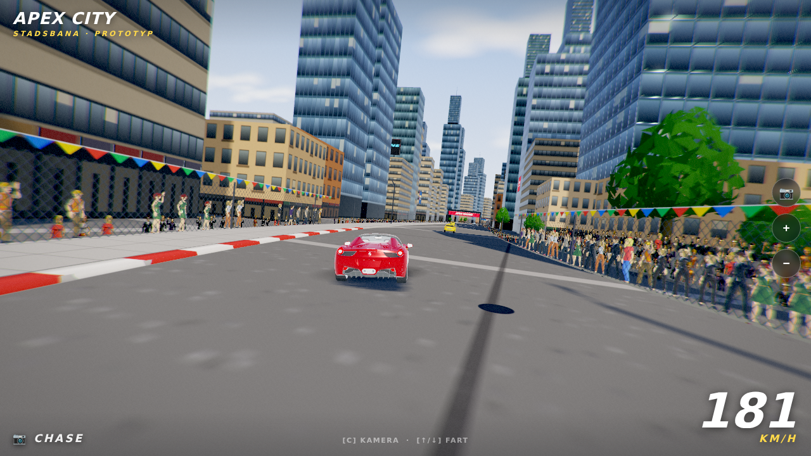
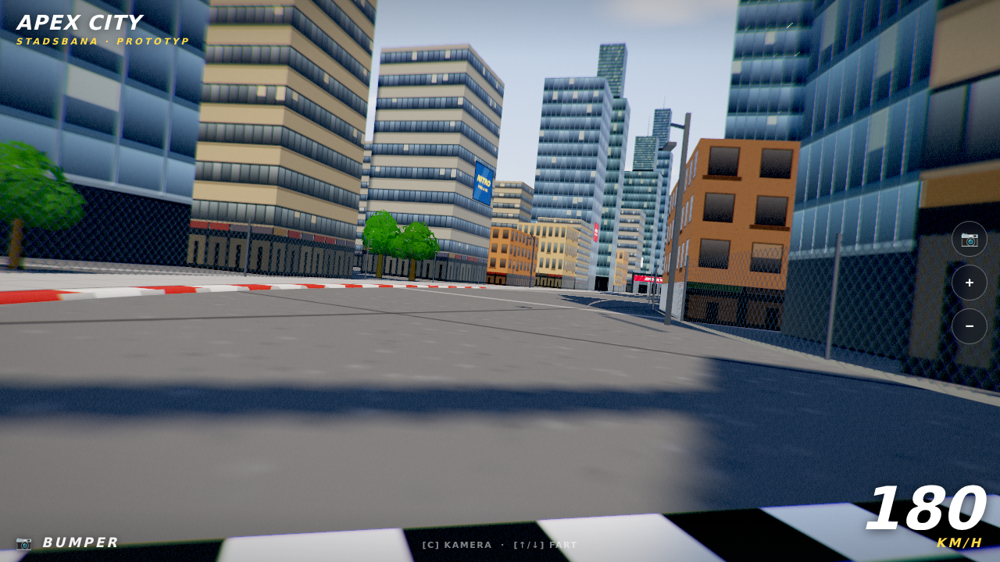
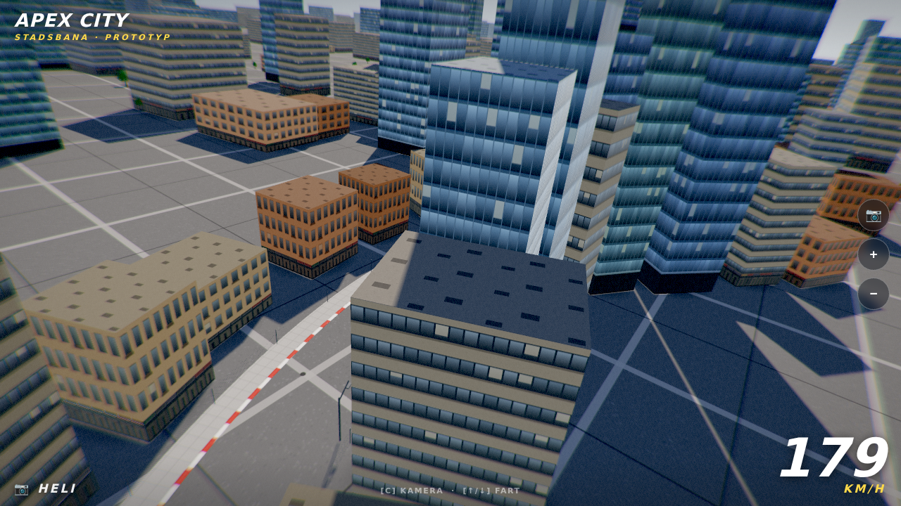

# APEX CITY — Racing game prototype

Ridge Racer-inspirerad stadsbana i dagsljus. Miljön (asfalt, fasader, staket,
banderoller, himmel, moln, publik-rekvisita) genereras **procedurellt i kod** —
fordonen och de animerade karaktärerna är fria CC0/CC-BY-modeller
(se [assets/LICENSES.md](assets/LICENSES.md)). Spelarbilen är en Ferrari 458
med styrande framhjul och rullande hjul, stadstrafik kör i båda filerna, och
publiken vinkar bakom staketen.



## Kör

Statisk sida, ingen build behövs — men ES-moduler kräver en webbserver:

```bash
python3 -m http.server 8000
# öppna http://localhost:8000
```

Funkar även direkt på GitHub Pages (Settings → Pages → deploy from branch).

## Kontroller

Spelet startar i *attract mode* — **gasa för att ta över bilen**.

| Funktion | Tangentbord | Handkontroll |
|---|---|---|
| Gas | `↑` / `W` | RT (höger avtryckare) |
| Broms / back | `↓` / `S` | LT (vänster avtryckare) |
| Styrning | `←→` / `A D` | Vänster spak (+ d-pad) |
| Handbroms (sladd!) | `Mellanslag` | A / Kryss |
| Titta bakåt | `B` | B / Cirkel |
| Tuta | `H` | X / Fyrkant |
| Reset (ställ på vägen) | `R` | Back / Select |
| Byt kamera | `C` | Y / Triangel |
| Ljud av/på | `M` | — |

Handkontrollen har vibration vid väggträff och trafikkontakt. Utan input
klipper attract-läget mellan kamerorna själv.

URL-parametrar: `?s=520&cam=2&speed=4` (startposition/kamera/attract-fart),
`?car=saab` (procedurell SVEN 9000-hyllning), `?car=proto` (skulpterad kupé),
`?paint=blue|yellow|silver|black|white|green`.

## Fler vyer




## Teknik

- **Three.js** (vendorerad i `vendor/`, inga CDN-beroenden — funkar offline)
- Banan är en sluten Catmull-Rom-spline (~2 km); väg, kantsten, trottoar och
  fångststaket extruderas som ribbons längs splinen
- ~1500 byggnader som `InstancedMesh` (3 fasadtyper × procedurella canvas-texturer),
  butiksfasader i gatuplan, tak med egen material-grupp
- Sol + skuggkarta som följer kameran, himmel i shader, IBL via PMREM från himlen,
  avståndsdis och bergssiluetter för djup
- **Post-processing i HDR** (egen pipeline, inga addons): bloom, radiell motion blur
  i fart, chromatic aberration, ACES-tonemapping, färggradering, vinjett, filmkorn
- **Materialdjup**: normal- och roughness-maps genereras ur höjdkartor i canvas —
  fönster ligger infällda i fasaderna och glas fångar sol/himmel; asfalten har
  polerade däckspårband, sprickor och tjärskarvar
- Kontaktskuggor (fejk-AO) under alla byggnader och träd, tornavsatser med antenner,
  väggreklamer, brunnslock, däckspår genom kurvorna, röd/vit kurvkantsten bara i kurvor
- Hela scenen ritas på ~40 draw calls — instansering + geometri-merge
- Adaptiv kvalitet: sänker pixel ratio och skuggupplösning automatiskt om
  bilduppdateringen sjunker, så det rullar även på mobil

## Byt ut bilen

Spelarbilen läses från **`assets/car.glb`** — byt fil så tar den nya modellen över
automatiskt: den skalas till rätt längd, ställs på marken, och hjulnoder (namn
som innehåller "wheel"/"front") hittas automatiskt för rullning + styrning.
Draco-komprimerade GLB:er stöds. Pekar modellen åt fel håll, justera med
URL-parametern `?carRot=90` (eller 180/270). Utan `car.glb` kör en procedurellt
skulpterad reservbil. Saknas nätverket är alla modeller redan committade i `assets/`.

Bra gratiskällor (GLB/glTF, testade licenser):

| Källa | Licens | Kommentar |
|---|---|---|
| [Kenney — Car Kit](https://kenney.nl/assets/car-kit) | CC0 | 40+ bilar, glTF ingår, perfekt stilnivå |
| [Kenney — Racing Kit](https://kenney.nl/assets/racing-kit) | CC0 | Racingbilar + banrekvisita |
| [Quaternius — Cars Pack](https://quaternius.com/packs/cars.html) | CC0 | 8 bilar (sport, taxi, polis, SUV) |
| [Quaternius Cars Bundle på Poly Pizza](https://poly.pizza/bundle/Cars-Bundle-FE5IWe6OMk) | CC0 | Samma paket, direkt GLB-nedladdning |
| [Poly Pizza — sök "car"](https://poly.pizza/) | CC0/CC-BY | 1000-tals modeller, filtrera på licens |
| [Sketchfab — downloadable](https://sketchfab.com/search?features=downloadable&licenses=322a749bcfa841b29dff1e8a1bb74b0b&q=car&type=models) | CC0-filter | Högre detaljnivå, kolla polycount |

CC0 = public domain: fritt att använda, ändra och committa i repot utan attribution.
(CC-BY kräver att upphovspersonen krediteras, t.ex. här i README.)

## Nästa steg

- Riktig bilmodell enligt ovan
- Fysik/styrning (spelarkontroll istället för attract mode)
- Fler bilar på skärmen (motståndare/trafik)
- Ljud, HUD-varvtider, natt/skymningsläge
